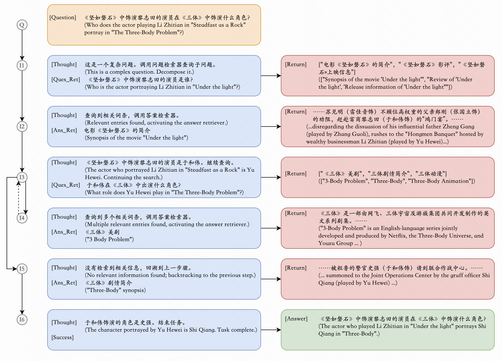

# D & Q

A Step Closer to Comprehensive Answers: Constrained Multi-Stage Question Decomposition with Large Language Models


## Trajectory Annotation




## Details on ChitChatQA

#### Tools

1. **QuestionRetriever**: Given a query question, return the top k questions relevant to the question from a trusted question database.
2. **AnswerRetriever**: Given questions from the question database, retrieve answers.
3. **Finish**: Return success or failure. If success, terminate the program; if failed, backtrack to the previous state.


#### Training

During the training phase, all multi-turn retrieval sapmles are terminated by "Finish," encompassing both "success" and "failed" scenarios. The training phase enables the model to learn the ability to determine termination based on current information.  Below are some training examples:

Case 1 (failed case):

```
user:
## 你能够利用多种函数来完成给定的任务。我会给定一个你目前无法直接回答的目标问题，请将给出的目标问题转化为等价的基本问题，并结合基本问题的答案，给出对目标问题可靠的回复。
## 目标问题: 《坚如磐石》中饰演黎志田的演员在《三体》中饰演什么角色？

assistant:
##Analysis: 这是一个复杂问题。调用问题检索器查询子问题。
##Function: QuestionRetriever
##Param: 《坚如磐石》中饰演黎志田的演员是谁？

user:
##Function_Return: ［"电影《坚如磐石》的简介"，"《坚如磐石》影评"，"《坚如磐石»上映信息"]

......

assistant:
##Analysis: 查询到多个相关词条，调用答案检索器。
##Function: PageRetriever
##Param: 《三体》美剧

user:
##Function_Return: 《三体》是一部由网飞、三体宇宙及游族集团共同开发制作的英文系列剧集。……

assistant:
##Analysis: 没有检索到相关信息，回溯到上一步骤。
##Function: Finish
##Param: Failed
```

Case 2 (success case):

```
user:
## 你能够利用多种函数来完成给定的任务。我会给定一个你目前无法直接回答的目标问题，请将给出的目标问题转化为等价的基本问题，并结合基本问题的答案，给出对目标问题可靠的回复。
## 目标问题: 《坚如磐石》中饰演黎志田的演员在《三体》中饰演什么角色？

assistant:
##Analysis: 这是一个复杂问题。调用问题检索器查询子问题。
##Function: QuestionRetriever
##Param: 《坚如磐石》中饰演黎志田的演员是谁？

user:
##Function_Return: ［"电影《坚如磐石》的简介"，"《坚如磐石》影评"，"《坚如磐石»上映信息"]

......

assistant:
##Analysis: 查询到多个相关词条，调用答案检索器。
##Function: AnswerRetriever
##Param: 《三体》美剧

user:
##Function_Return: 调用AnswerRetriever查询《三体》美剧没有有效信息。

assistant:
##Analysis: 调用答案检索器检索其他词条。
##Function: AnswerRetriever
##Param: 《三体》剧情简介

......

assistant:
##Analysis: 于和伟饰演的角色是史强。结束任务。
##Function: Finish
##Param: Success
```


#### Inference

Different from the training phase, during the inference, if the model invokes "Finish" with the parameter "success," the program terminates; if the parameter is "failed," the program backtracks. The specific operation involves replacing the last step of the dialogue history with: "调用xx查询xx没有有效信息" ("Calling bluhbluh did not retrieve valid information").

The termination conditions are: the model calling "Finish" returns success or the retrieval exceeds the maximum step limit.


#### Case study


```
user:
## 你能够利用多种函数来完成给定的任务。我会给定一个你目前无法直接回答的目标问题，请将给出的目标问题转化为等价的基本问题，并结合基本问题的答案，给出对目标问题可靠的回复。
## 目标问题: 连续吐了一个晚上怎么办？

assistant:
##Analysis: 调用QuestionRetriever检索相关基本问题。
##Function: QuestionRetriever
##Param: 连续吐了一个晚上怎么办？

user:
##Function_Return: ['每天晚上连着呕吐怎么回事', '吐了之后怎么缓解最好', '出现了呕吐怎么办', '如果感觉到要吐该怎么办？', '关于吐了怎么治疗']

assistant:
##Analysis: 从上一步返回的基本问题中，'每天晚上连着呕吐怎么回事'和'吐了之后怎么缓解最好'两个问题与目标问题相关性较高，我将使用AnswerFinder函数找到这两个问题的答案，以确定它们是否可以帮助解答目标问题。首先，我将查找'每天晚上连着呕吐怎么回事'这个问题的答案。
##Function: AnswerRetriever
##Param: 每天晚上连着呕吐怎么回事

user:
##Function_Return: 每天晚上连续呕吐可能是由于多种原因引起的。首先，可能是由于饮食不洁或者脾胃受寒导致的。其次，可能是由于急性肠胃炎引起的。此外，精神性因素也可能导致晚上呕吐。针对不同原因，可以采取不同的措施。例如，如果是饮食不洁或者脾胃受寒，可以喝温开水、生姜煮红糖水，用热水袋进行胃部的热敷，多吃温阳益气食物。如果是急性肠胃炎，需要及时补充液体、合理饮食、适当卧床休息和调节情绪。如果是精神性呕吐，需要卧床休息，头应该偏向一侧，学会调节情绪，让大脑完全处于放松状态……

assistant:
##Analysis: 上一步我们得到了'每天晚上连着呕吐怎么回事'这个问题的答案，现在我们需要得到第二个相关问题'吐了之后怎么缓解最好'的答案，以便更全面地回答目标问题。
##Function: AnswerRetriever
##Param: 吐了之后怎么缓解最好

user:
##Function_Return: 1. 大量喝水: 吐完之后，要补充流失的水分，可以喝一些清水、淡盐水或者运动饮料，以保持身体的水分平衡。2. 吃一些易消化的食物: 吐完后，可以吃一些如米粥、蒸蛋、面条等易消化的食物，以帮助消化系统恢复。3. 休息: 吐完之后，要确保充足的休息时间，让身体有足够的时间恢复。4. 避免油腻、辛辣等刺激性食物: 吐完之后，要避免食用油腻、辛辣等刺激性食物，以免刺激胃肠道，加重不适感。5. 保持良好的生活习惯: 吐完后，要保持良好的作息时间，避免熬夜、抽烟、饮酒等不良生活习惯。6. 避免剧烈运动: 吐完之后，要避免剧烈运动，以免加重胃肠道负担，影响身体恢复。7. 如有需要，可服用药物: 若吐后身体感到不适，可按照医生的建议服用药物，如止吐药、胃肠道药物等。8. 注意保暖: 吐完后，要注意保暖，避免受凉，以免加重胃肠道不适。9. 如症状持续或加重，请及时就医: 如果吐后症状持续或加重，请及时就医，以免延误治疗。

assistant:
##Analysis：通过前面的步骤，我们已经找到了与目标问题相关的两个基本问题，并且得到了这两个问题的答案。现在我们需要综合这两个问题的答案，得出对目标问题的回答。首先，每天晚上连续呕吐可能是由于多种原因引起的。首先，可能是由于饮食不洁或者脾胃受寒导致的。其次，可能是由于急性肠胃炎引起的。此外，精神性因素也可能导致晚上呕吐。针对不同原因，可以采取不同的措施。例如，如果是饮食不洁或者脾胃受寒，可以喝温开水、生姜煮红糖水，用热水袋进行胃部的热敷，多吃温阳益气食物。如果是急性肠胃炎，需要及时补充液体、合理饮食、适当卧床休息和调节情绪。如果是精神性呕吐，需要卧床休息，头应该偏向一侧，学会调节情绪，让大脑完全处于放松状态。吐了之后，要补充流失的水分，可以喝一些清水、淡盐水或者运动饮料，以保持身体的水分平衡。吃一些易消化的食物，如米粥、蒸蛋、面条等。休息，确保充足的休息时间，让身体有足够的时间恢复。避免油腻、辛辣等刺激性食物，以免刺激胃肠道，加重不适感。保持良好的作息时间，避免熬夜、抽烟、饮酒等不良生活习惯。避免剧烈运动，以免加重胃肠道负担，影响身体恢复。若吐后身体感到不适，可按照医生的建议服用药物，如止吐药、胃肠道药物等。注意保暖，避免受凉，以免加重胃肠道不适。如症状持续或加重，请及时就医，以免延误治疗。
##Function: Finish
##Param: Success
```


